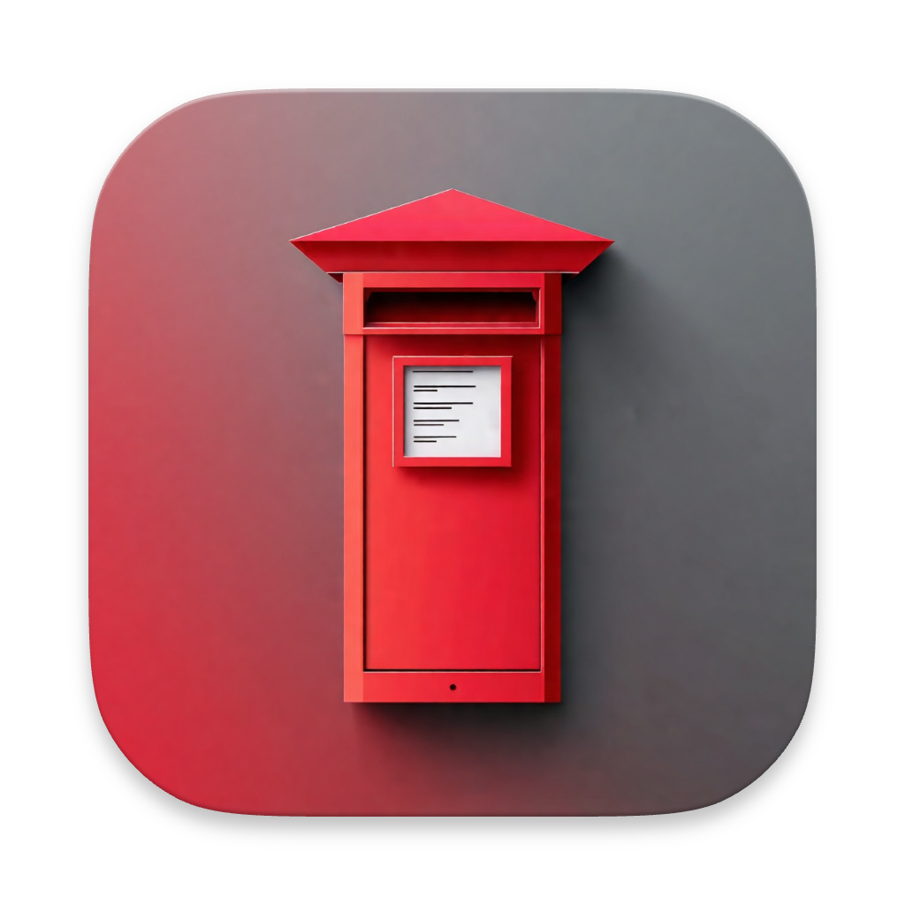

<h1 align="center">Pillar Box</h1>

<p align="center">

</p>
<p align="center">
Pillar Box recreates the "AutoFill for SMS codes" feature that is available in Safari on macOS, but for Chromium based browsers (Chrome, Arc, Edge, etc).
</p>
<p align="center">
Install both the macOS app and the Chromium extension to get started easily auto-filling SMS codes that you receive via SMS on your iPhone. Please note that SMS sharing between iPhone and your Mac must be enabled.
</p>

## Key features

- Automatically fill in SMS codes from your messages
- No need to copy and paste codes from messages, or switch between apps
- Secure, nothing leaves your machine

## Getting started

The easiest way to get started is to download the latest release from the [releases page](releases). Download both files:

- `Pillar Box.zip` - The native macOS application
- `pillar-box-chromium-extension.zip` - The Chromium extension

Extract the app from the archive and run it, you may need to go to System Settings > Privacy & Security > Full Disk Access and allow the app for it to run.

Extract the extension from the archive and navigate to `chrome://extensions/` in your browser. Enable "Developer mode" in the top right corner, click "Load unpacked" and select the extension you just extracted.

That should be it, go to a website that requires an SMS code and you should see the code automatically filled in.

## Source structure

```
.
├── assets         # Assets for the repo, app icons, chrome store images, etc.
├── postmaster     # Native macOS application
├── extension      # Chromium extension
├── example-server # Example server to test the extension
└── README.md      # 📍 You are here
```

## Building from source

### Native macOS application

After running you may need to go to System Settings > Privacy & Security > Full Disk Access and allow the app for it to run.

```bash
$ cd postmaster
$ go run cmd/main.go --debug # Run the app in debug mode
$ go run cmd/main.go         # Run the app, without debug mode
$ go build cmd/main.go       # Build the app
```

### Chromium extension

1. Open `chrome://extensions/` in your browser (tested with Chrome and Arc)
2. Enable "Developer mode" in the top right corner
3. Click "Load unpacked" and select the `extension` directory
